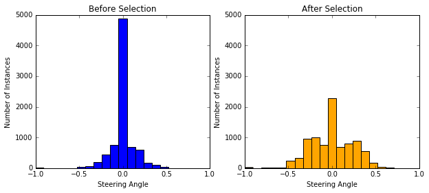
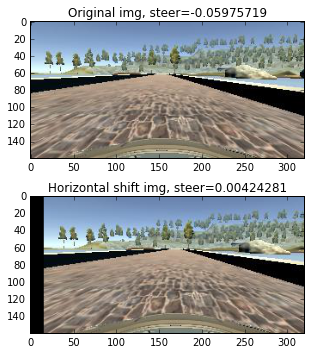
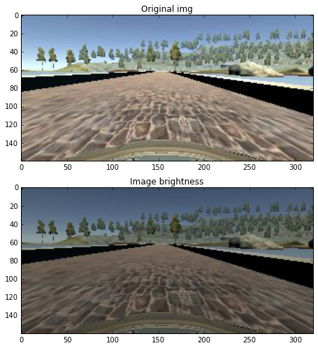
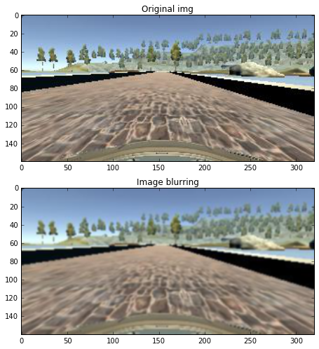
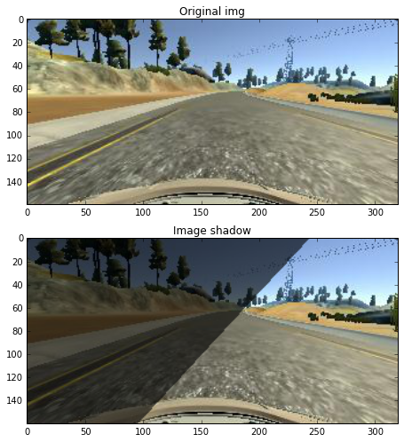
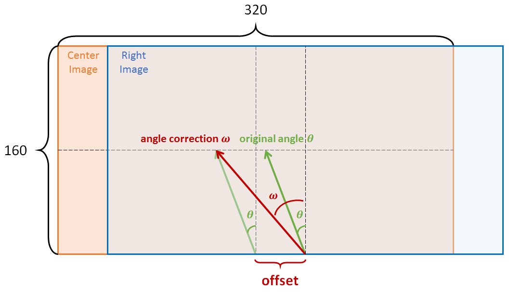
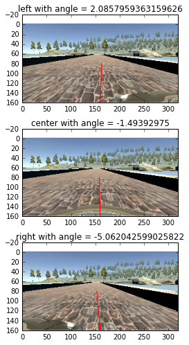
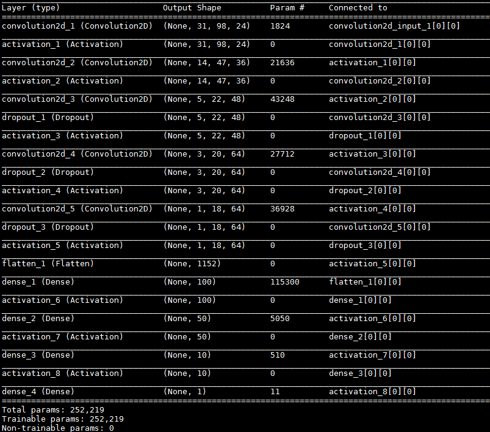
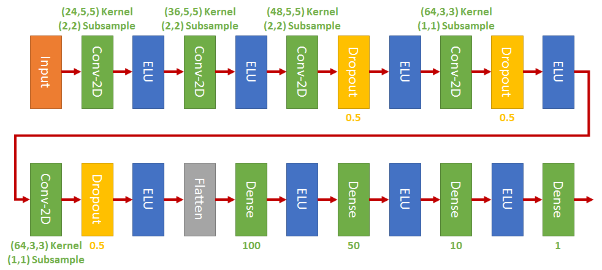
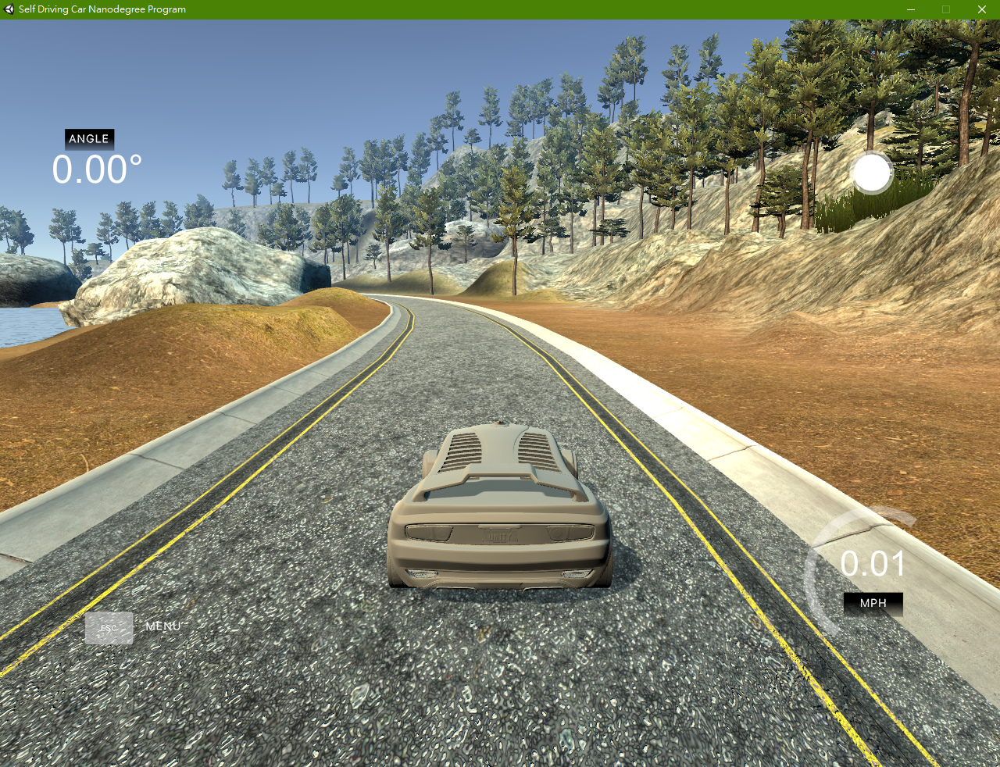

### Udacity Self Driving Project 3: behavioral cloning

A great simulator is provided that can log your driving data (speed, throttle, brake, steering, and images) and test the driving algorithm.
Two modes are provided, `Training mode` and `Atuonomous mode`. By using `Training mode`, you can collect training data to train the model. Then test the model with the `Atuonomous mode`.
For those driving log data, *steering* and *images* are the most important features that we are going to used in this project.

> **The goal is, given an image, find out the corresponding steering angle.**

Some might wonder that speed, throttle, and brake are features that are useful.
Also, driving images are time correlated, not just a given static image.
With ignoring so much useful information, does the goal still reasonable?
[Nvidia](https://images.nvidia.com/content/tegra/automotive/images/2016/solutions/pdf/end-to-end-dl-using-px.pdf) just showed it works! and works pretty well!
So our first step is to collect the data. Fortunately, Udacity provided data for us and I used those data for training.

### Training Data Analysis
8036 data are provided. Each data has **3** positions of images (left, center, right) with **1** corresponding steering angle.
Most of angles are 0, and I found that randomly ignoring half of 0-angle data is fine and can speed up. Moreover, I duplicated some samples that has angles within the range +-[0.2, 1] in order to balance the data.
Histograms of before/after data selection are shown below:


### Data Augmentation
Data augmentation is a practical way to avoid overfit and generalized the model. I used 5 types of augmentations:
1. **Flipping** -- Flipping is a useful way to *balancing both turns* of data. For each training data, a 1/2 probability is used to decide wheter to flip. Also, steering angle is multiplied by -1.

2. **Horizontal shift** -- \[-20,+20\] pixels are randomly selected as the shift value. By doing so, it can help to recover the vehicle when it goes outside the lane.
By referencing this [article](https://chatbotslife.com/using-augmentation-to-mimic-human-driving-496b569760a9#.zem65mq24), I added 0.004 steering angle units per pixel shift to the right, and subtracted 0.004 steering angle units per pixel shift to the left.
\[-0.8~+0.8\] steering values are adjusted which corresponding to \[-2~+2\] degrees (because steering value * 25 is the degree by setting)


3. **Brightness** -- The brightness is done in the "HSV" domain. I found that with a ratio of \[0.5~1.1\] for "V" value works fine.


4. **Blurring** -- A Gaussian blur with kernel size 3 is applied. Not sure how useful of this method helps for robustness.

<!--5. **Shadowing** -- A random shadowing function is adopted which is referenced from [this work](https://github.com/windowsub0406/SelfDrivingCarND/blob/master/SDC_project_3/model.ipynb).
-->

6. **Left/Right camera images** -- These left/right images are very useful for data augmentation and also help for recovering off-lane driving.
  > **Udacity**: You also might wonder why there are three cameras on the car: center, left, and right. That's because of the issue of recovering from being off-center.
  > In the simulator, you can weave all over the road and turn recording on and off. In a real car, however, that's not really possible. At least not legally.
  > So in a real car, we'll have multiple cameras on the vehicle, and we'll map recovery paths from each camera. 

I adjusted the steering angles for left/right images with a naive method. Following figure shows how I correct the angle of right image:

I found that setting offset = 6 or 5 is good enough. For large value, the car starts zig-zagging. An example of correction shows below, where the steering angles are indicated by red lines:


### Data Normalization
* Normalization -- Images are normalized with (x-128)/128.
* Cropping -- Images are trimmed with 40, 20, 20, and 20 pixels from top, bottom, left, and right respectively. This will cut most of the car hood and sky.
* Resizing -- resized to 66 x 200, same as NVIDIA CNN.

### Model Architecture

I adopted NVIDIA CNN with dropout layers:


<!--
| Layer (type) | Output Shape | Param |
| ------------ |--------------| ------|
| Conv2D-1 | (None,31,98,24) | 1824 |
| ELU | (None,31,98,24) | 0 |
| Conv2D-2 | (None,14,47,36) | 21636 |
| ELU | (None,14,47,36) | 0 |
| Conv2D-3 | (None,5,22,48) | 43248 |
| Dropout | (None,5,22,48) | 0 |
| ELU | (None,5,22,48) | 0 |
| Conv2D-4 | (None,3,20,64) | 27712 |
| Dropout | (None,3,20,64) | 0 |
| ELU | (None,5,22,48) | 0 |
| Conv2D-5 | (None,1,18,64) | 36928 |
| Dropout | (None,1,18,64) | 0 |
| ELU | (None,1,18,64) | 0 |
| Flatten | (None,1152) | 0 |
| Dense | (None,100) | 115300 |
| ELU | (None,100) | 0 |
| Dense | (None,50) | 5050 |
| ELU | (None,50) | 0 |
| Dense | (None,10) | 510 |
| ELU | (None,10) | 0 |
| Dense | (None,1) | 11 |
Total parameters 252,219
-->

### Generator and Training
* **Generator**: It is very useful to use a python generator to feed the training data batch-by-batch rather than loading all the data in memory at once.
A useful link to learn python iterator/generator list [here](http://anandology.com/python-practice-book/iterators.html) ( for those who doesn't familiar with python just like me :) ).

>In order to further speed up. I tried pre-loading a chunck of data, e.g. 5000 images, into memory, and loaded another chunck if the batch data (required by generator) is outside the chunck in memory. However, it **does not** speed up! Somewhat weired.

For each input images, a position is randomly chosen (left,center,right).
Then flipping and shadowing are applied with a random fair coin. Finally, brighteness and horizonal shift are applied with steering angle adjustment.

* **Training**: Some hyper-parameters are listed:
  * epoch--50
  * samples for each epoch -- 8896
  * optimizer -- Adam with 1e-4
  * batch-size -- 64

Although Keras did shuffle, it only applies in the batched data. So I shuffled the entire training set for each epoch to get more *de-correlated* data.

### Driving Policy
I found that instead of giving a constant throttle, controlling to a constant speed is more stable to drive.
So I used a simple policy that tries to keep speed to 20.
```python
speed = float(speed)
    if speed > 25:
        throttle = 0.05
    elif speed > 20:
        throttle = 0.2
    elif speed > 10:
        throttle = 0.35
    else:
        throttle = 0.5
```

### Results
See below for the track1 drive.
[](https://www.youtube.com/watch?v=6FjHBC4Pwok)
However, I failed on track2. Hit a wall during a right turn and still working on it.
Hope some tweaks on data selection and model architecture might work~